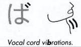
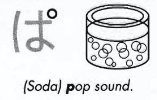

labels: Japanese
created: 2016-06-25T21:18

# Hiragana

/a/ - あ
/i/ - い (eels)
/u/ - う [ゔ]
/e/ - え (a man doing exercise)
/o/ - お

/ka/ - か [が]
/ki/ - き (key) [ぎ]
/ku/ - く (cuckoo bird) [ぐ]
/ke/ - け [げ]
/ko/ - こ [ご]

/sa/ - さ [ざ]
/si (shi)/ - し (she has a ponytail) [じ]
/su/ - す (sooey's tail) [ず]
/se/ - せ (серп і молот) [ぜ]
/so/ - そ [ぞ]

/ta/ - た (ta) [だ]
/ti/ (/chi/) - ち (cheerleader) [ぢ]
/tu/ (/tsu/) - つ (tsunami) [づ]
/te/ - て (т) [で]
/to/ - と (toe) [ど]

/na/ - な (a nun is kneeling in front of cross)
/ni/ - に (a needle and thread)
/nu/ - ぬ (noodles and chopsticks)
/ne/ - ね (a net)
/no/ - の (no enter sign)

/ha/ - は (house) [ば, ぱ]
/hi/ - ひ [び, ぴ]
/hu/ (/fu/) - ふ (Mt. Fuji) [ぶ, ぷ]
/he/ - へ (a haystack) [べ, ぺ]
/ho/ - ほ (a house becomes a home with a satellite) [ぼ, ぽ]

/ma/ - ま (mama loves music)
/mi/ - み (who is 21? Me!)
/mu/ - む (a cow says moo)
/me/ - め (chopsticks and noodles without mess)
/mo/ - も (the more worms, the more fish)

/ya/ - や (yacht)
/yu/ - ゆ (ю)
/yo/ - よ (yoga)

/ra/ - ら
/ri/ - り (looks similar to い)
/ru/ - る
/re/ - れ
/ro/ - ろ

/wa/ - わ
/wo/ (/o/) - を (whoa)
/nn/ - ん (n)

## Digraphs and diacritics

Use dokuten for:

k -> g: か /ka/ -> が /ga/
s -> z: さ /sa/ -> ざ /za/
t -> d: た /ta/ -> だ /da/ (except ぢ /dzi/, づ /zu/)
h -> b: は /ha/ -> ば /ba/
u -> vu: う /u/ -> ゔ /vu/

This mark changes the pronounciations of all the kana in the series beginning ka, sa, ta, and ha to vibrating sounds: ga, za, da, and ba.

Use handakuten for:

h -> p: は /ha/ -> ぱ /pa/

This mark changes the pronounciations of ha, hi, fu, he, and ho to "popping" sounds: pa, pi, pu, pe, and po.

Docuten and handakuten are similar to diacritics (also known as "accents") which uses with Latin letters.

?ゃ ads /ja/ or /a/: き /ki/ -> きゃ /kya/
?ゅ ads /yu/ or /u/: き /ki/ -> きゅ /kyu/
?ょ ads /yo/ or /o/: き /ki/ -> きょ /kyo/

These kana written small turn ki, shi, chi, ni, hi, mi, ri into kya, sha, cha, nya, hya, mya, rya, kyu, shu, chu, nyu, hyu, myu, ryu and kyo, sho, cho.

The kana u is used to double the O and U vowel sounds of other kana: ko -> koo, ku -> kuu.

Certain consonants are doubled by a smaller, silent tsu.

## Links

[Hiragana on Wikipedia](https://en.wikipedia.org/wiki/Hiragana)
[Mnemonic hiragana](http://japanese.gatech.edu/WebCTVista/JAPN1001/contents/Lesson02/hiragana/mnemonic-hiragana.html)
[Bubblelanguages](https://www.bubblelanguages.com)
