labels: Japanese
created: 2016-11-03T17:32

# Hiragana mnemonics clean

[TOC]

## /a/ - あ

Ah! I see the letter "A".

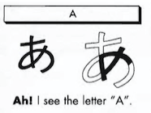

## /i/ - い

The two "I's" in Hawaii.

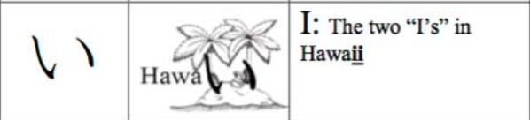

## /u/ - う

Uuu! This is heavy.

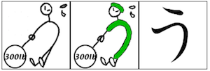

## /e/ - え

Exotic bird.

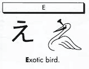

## /o/ - お

A golf ball is on the green.

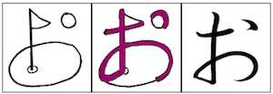

## /ka/ - か

Someone doing the "can-can" dance.

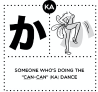

## /ki/ - き

I have a key.

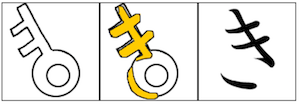

## /ku/ - く

A cuckoo bird is singing.

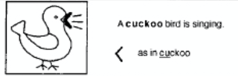

## /ke/ - け

A man with the cane.

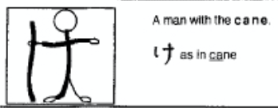

## /ko/ - こ

It's a coin.

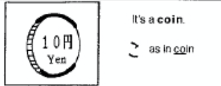

## /sa/ - さ

I love sake!

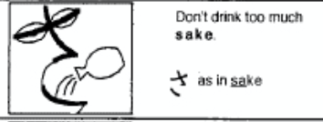

## /si (shi)/ - し

She has a ponytail.

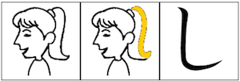

## /su/ - す

Sooey's tail.

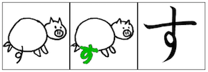

## /se/ - せ

How sexy is that tooth?

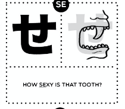

## /so/ - そ

A songbird.

## /ta/ - た

"t" and "a" make ta.

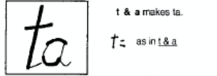

## /ti/ (/chi/) - ち

She is a cheerleader.

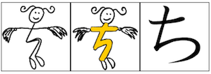

## /tu/ (/tsu/) - つ

Tsunami is a tidal wave.

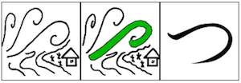

## /te/ - て

The dog has a wagging tail.

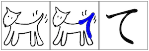

## /to/ - と

Ouch! A thong is in my toe.

## /na/ - な

A nun is kneeling in front of a cross.

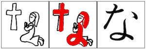

## /ni/ - に

I have a needle and thread.

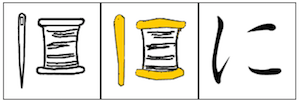

## /nu/ - ぬ

Noodles and chopsticks.

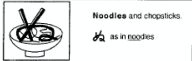

## /ne/ - ね

I caught a big fish in the net.
a net

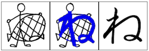

## /no/ - の

This means NO!

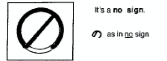

## /ha/ - は

I live in a house.

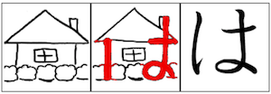

## /hi/ - ひ

He has a big nose.

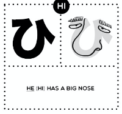

## /hu/ (/fu/) - ふ

Mt. Fuji is beautiful.

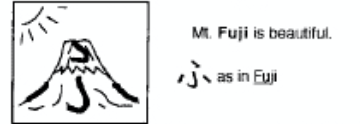

## /he/ - へ

There is a haystack.

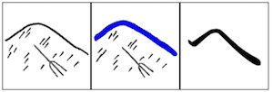

## /ho/ - ほ

A house becomes a home with a satellite.

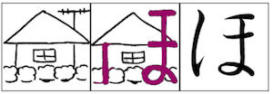

## /ma/ - ま

Mama loves music.

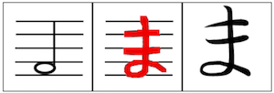

## /mi/ - み

Who is 21? Me!

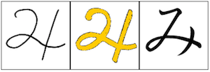

## /mu/ - む

A cow says moo.

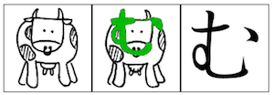

## /me/ - め

Chopsticks and noodles without mess.

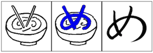

## /mo/ - も

The more worms, the more fish.

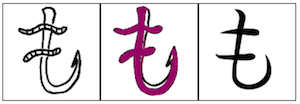

## /ya/ - や

A yacht in the ocean.

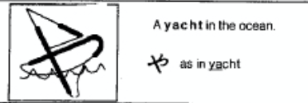

## /yu/ - ゆ

A unique looking fish.

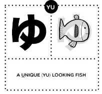

## /yo/ - よ

Yoga is hard!

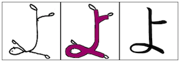

## /ra/ - ら

I love steamy ramen noodles.

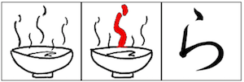

## /ri/ - り

This ribbon has long tails.

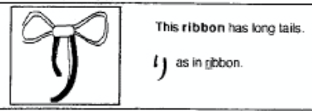

## /ru/ - る

Three rubies.

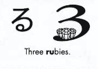

## /re/ - れ

Let's race!

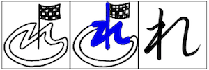

## /ro/ - ろ

Three rubies rolled away.

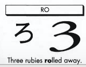

## /wa/ - わ

Wow! A magic wand!

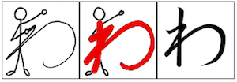

## /wo/ (/o/) - を

Whoa! A cheerleader is on my toe!

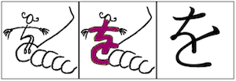

## /nn/ - ん

This is in the end.

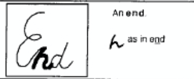
