labels: Japanese
created: 2016-10-17T15:43

# Hiragana mnemonics

[TOC]

## /a/ - あ

An antenna is on top of the roof. あ as in "antenna."

Find the capital A in あ.

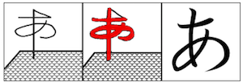

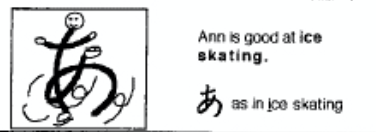

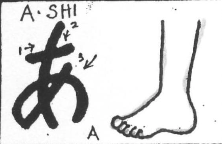

A-shi.

Color: fe0000

## /i/ - い

There are two eels. い as in "eels."

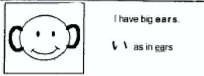

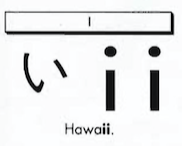

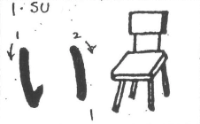

I-su.

Color: fe0000

## /u/ - う

Ooo! This is heavy. う as in "Ooo!"

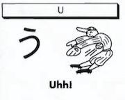

Find the U in う.

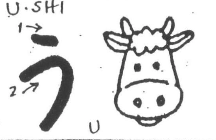

U-shi.

Color: fe0000

## /e/ - え

I have to exercise. え as in "exercise."

a man doing exercise

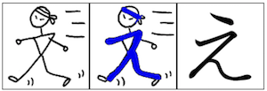

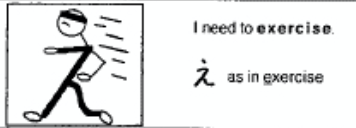

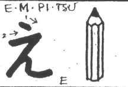

E-m-pi-tsu.

Color: fe0000

## /o/ - お

A golf ball is on the green. お as in "on."

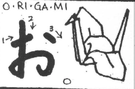

O-ri-ga-mi.

Color: fe0000

## /ka/ - か

A kite is flying in the sky. か as in "kite."

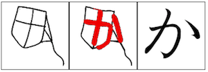

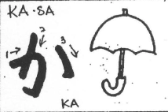

Ka-sa.

Color: ff6634

## /ki/ - き

I have a key. き as in "key."

key

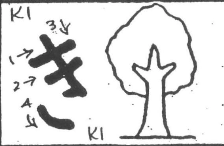

Ki - tree.

Color: ff6634

## /ku/ - く

Here comes a cuckoo bird. く as in "cuckoo."

cuckoo bird

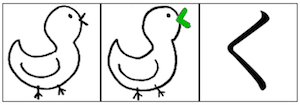

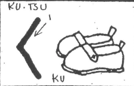

Ku-tsu.

Color: ff6634

## /ke/ - け

There's a keg of beer. け as in "keg."

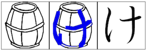

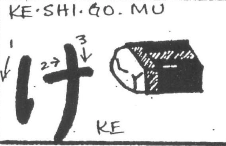

Ke-shi-go-mu - eraser.

Color: ff6634

## /ko/ - こ

A core of an apple is hard to eat. こ as in "core."

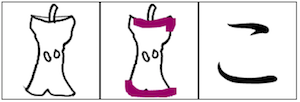

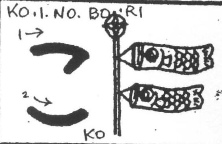

Ko-i-no-bo-ri.

Color: ff6634

## /sa/ - さ

I love sake! さ as in "sake."

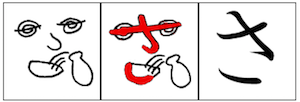

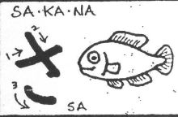

Sa-ka-na.

Color: 9a00ff

## /si (shi)/ - し

she has a ponytail

(pronounced as /shi/) She has a ponytail. し as in "she."

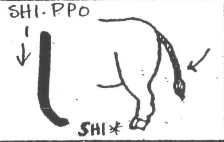

Shi-ppo.

Color: 9a00ff

## /su/ - す

Sooey, sooey! す as in "sooey."

sooey's tail

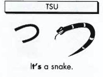

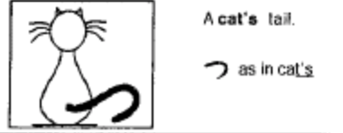

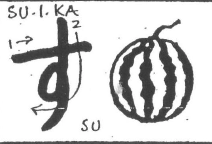

Su-i-ka.

Color: 9a00ff

## /se/ - せ

This is Senor Lopez. せ as in "senor."

серп і молот

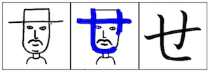

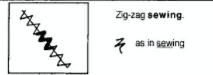

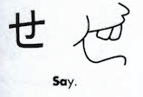

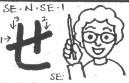

Se-n-se-i.

Color: 9a00ff

## /so/ - そ

Zig-zag sewing. そ as in "sewing."

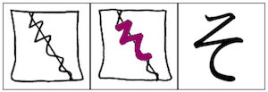

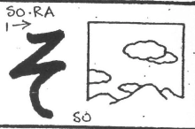

So-ra.

Color: 9a00ff

## /ta/ - た

ta

"t" and "a" make ta. た as in "ta."

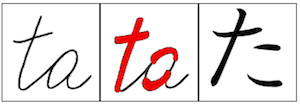

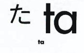

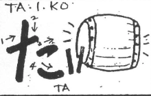

Ta-i-ko.

Color: 0000fe

## /ti/ (/chi/) - ち

(pronounced as /chi/) She is a cheerleader. ち as in "cheerleader."

cheerleader

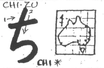

Chi-zu.

Color: 0000fe

## /tu/ (/tsu/) - つ

(pronounced as /tsu/) Tsunami is a tidal wave. つ as in "tsunami."

tsunami

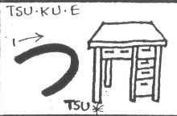

Tsu-ku-e.

Color: 0000fe

## /te/ - て

т

The dog has a wagging tail. て as in "tail."

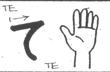

Te - hand (palm?).

Color: 0000fe

## /to/ - と

Ouch! A nail is in my toe. と as in "toe."

toe

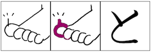

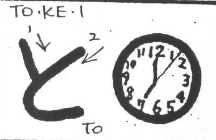

To-ke-i.

Color: 0000fe

## /na/ - な

A nun is kneeling in front of a cross. な as in "nun."

a nun is kneeling in front of cross

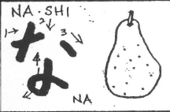

Na-shi.

Color: 009865

## /ni/ - に

I have a needle and thread. に as in "needle."

a needle and thread

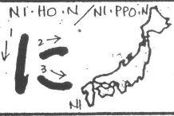

Ni-ho-n (Ni-ppo-n)

Color: 009865

## /nu/ - ぬ

noodles and chopsticks

Noodles and chopsticks. ぬ as in "noodles."

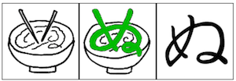

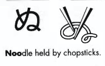

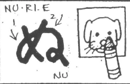

Nu-ri-e.

Color: 009865

## /ne/ - ね

I caught a big fish in the net. ね as in "net."

a net

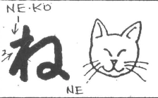

Ne-ko.

Color: 009865

## /no/ - の

This means NO! の as in "No."

no enter sign

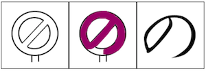

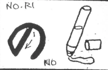

No-ri.

Color: 009865

## /ha/ - は

I live in a house. は as in "house."

house

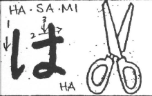

Ha-sa-mi.

Color: 00ff01

## /hi/ - ひ

He is on the wall. ひ as in "he."

Hi-tsu-ji.

Color: 00ff01

## /hu/ (/fu/) - ふ

I climbed Mt. Fuji. ふ as in "Fuji."

Mt. Fuji

Fu-u-se-n.

Color: 00ff01

## /he/ - へ

There is a haystack. へ as in "haystack."

a haystack

He-bi.

Color: 00ff01

## /ho/ - ほ

A house becomes a home with a satellite. ほ as in "home."

a house becomes a home with a satellite

Ho-shi.

Color: 00ff01

## /ma/ - ま

Mama loves music. ま as in "mama."

mama loves music

Ma-do.

Color: cdce34

## /mi/ - み

Who is 21? Me! み as in "me."

who is 21? Me!

Mi-ka-n.

Color: cdce34

## /mu/ - む

a cow says moo

Moo-moo more milk? む as in "moo."

Mu-shi.

Color: cdce34

## /me/ - め

Chopsticks and noodles without mess. め as in "mess."

chopsticks and noodles without mess

Me - eyes.

Color: cdce34

## /mo/ - も

The more worms, the more fish. も as in "more."

the more worms, the more fish

Mo-mo.

Color: cdce34

## /ya/ - や

I am sailing on a yacht. や as in "yacht."

yacht

Ya-gi.

Color: fe9900

## /yu/ - ゆ

ю

Make a U-turn as quickly as you can! ゆ as in "U-turn."

Yu-ki.

Color: fe9900

## /yo/ - よ

Yoga is hard! よ as in "yoga."

yoga

Yo-ru.

Color: fe9900

## /ra/ - ら

I love steamy ramen noodles. ら as in "ramen."

Ra-ku-da.

Color: fe0000

## /ri/ - り

I'll give you a ribbon. り as in "ribbon."

looks similar to い

Ri-n-go.

Color: fe0000

## /ru/ - る

Look at my loop! る as in "loop."

Ka-e-ru.

Color: fe0000

## /re/ - れ

Let's race! れ as in "race."

Re-i-zo-u-ku.

Color: fe0000

## /ro/ - ろ

I'm a roper! ろ as in "roper."

Ro-u-so-ku.

Color: fe0000

## /wa/ - わ

Wow! A magic wand! わ as in "wand."

Wa-ni.

Color: fe9900

## /wo/ (/o/) - を

(pronounced as /o/) Whoa! A cheerleader is on my toe! を as in "whoa."

whoa

Wo.

Color: fe9900

## /nn/ - ん

(pronounced like /ng/) This is in the end. ん as in "end."

This kana looks just like the lowercase n in English.

Ho-n.

Color: fe9900