labels: Japanese
created: 2016-10-18T09:29

# Katakana mnemonics

[TOC]

## /a/ - ア

Let's dig an underground tunnel! ア as in "underground".

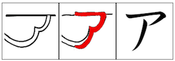

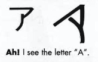

Color: fe0000

## /i/ - イ

i

I want an easel. イ as in "easel".

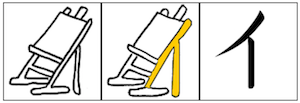

Color: fe0000

## /u/ - ウ

cyrillic u - у

Looks like hiragana う.

I have oodles of arrowheads. ウ as in "oodles".

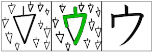

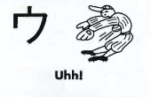

Color: fe0000

##  /e/ - エ

I have an extra bone. エ as in "extra".

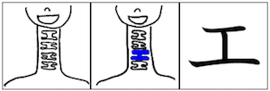

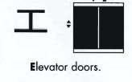

Color: fe0000

## /o/ - オ

Oh! What an odd kick! オ as in "oh".

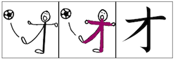

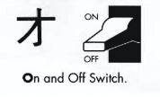

Color: fe0000

## /ka/ - カ

similar to か

A kite is flying in the sky. カ as in "kite".

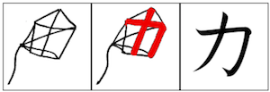

Color: ff6634

## /ki/ - キ

key, similar to き

I have a key. キ as in "key".

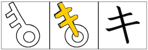

Color: ff6634

## /ku/ - ク

This is a quick seven. ク as in "quick".s

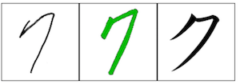

Color: ff6634

## /ke/ - ケ

It's a crooked "K". ケ as in crooked "K".

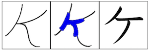

Color: ff6634

## /ko/ - コ

I have a cold. コ as in "cold".

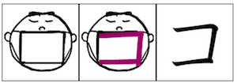

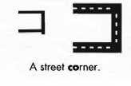

Color: ff6634

## /sa/ - サ

Let socks dry. サ as in "socks".

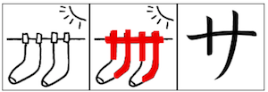

Color: 9a00ff

## /si (shi)/ - シ

She has a crooked smile. シ as in "she".

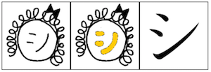

Color: 9a00ff

## /su/ - ス

My kid has a swing set. ス as in "swing".

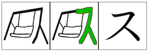

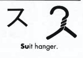

Color: 9a00ff

## /se/ - セ

similar to せ, серп і молот

This is Senor Martines. セ asn in "Senor".

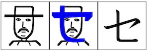

Color: 9a00ff

## /so/ - ソ

A soy bean jumped out! ソ as in "soy".

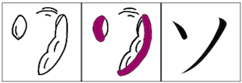

Color: 9a00ff

## /ta/ - タ

Titanic is sinking. タ as in "Titanic".

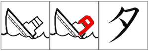

Color: 0000fe

## /ti/ (/chi/) - チ

A chimp is on the ball. チ as in "chimp".

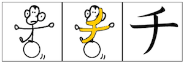

Color: 0000fe

## /tu/ (/tsu/)

I havde three peanuts. ツ as in "peanuts".

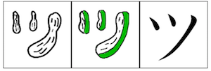

Color: 0000fe

## /te/ - テ

A cat's tail. テ as in "tail".

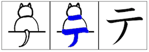

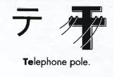

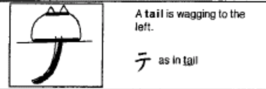

Color: 0000fe

## /to/ - ト

This is a tomahawk. ト as in "tomahawk".

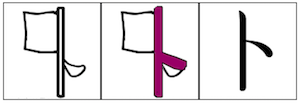

Color: 0000fe

## /na/ - ナ

Number 1, 2, and 3. ナ as in "number".

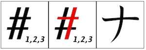

Color: 009865

## /ni/ - ニ

I have two needles. ニ as in "needles".

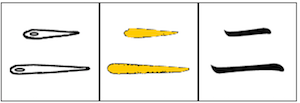

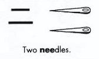

Color: 009865

## /nu/ - ヌ

Look at my new dress! ヌ as in "new".

Color: 009865

## /ne/ - ネ

Balancing is never easy! ネ as in "never".

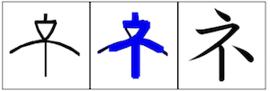

Color: 009865

## /no/ - ノ

He has a long nose. ノ as in "nose".

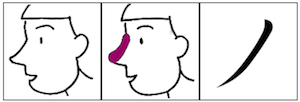

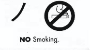

Color: 009865

## /ha/ - ハ

Ha, ha, ha! I can't stop laughing. ハ as in "ha".

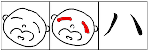

Color: 00ff01

## /hi/ - ヒ

This is my heel. ヒ as in "heel".

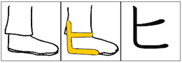

Color: 00ff01

## /hu/ (/fu/) - フ

A hook on a wall. フ as in "hook".

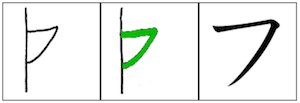

Color: 00ff01

## /he/ - へ

There is a haystack. ヘ as in "haystack".

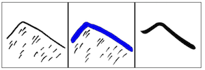

Color: 00ff01

## /ho/ - ホ

I'm holding a holy cross. ホ as in "holy".

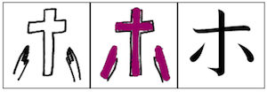

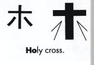

Color: 00ff01

## /ma/ - マ

Don't drink too much Martini. マ as in "Martini".

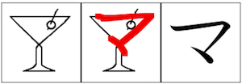

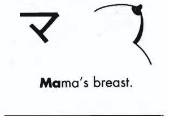

Color: cdce34

## /mi/ - ミ

Who is 3? Me! ミ as in "me".

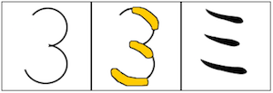

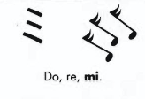

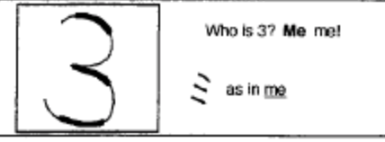

Color: cdce34

## /mu/ - ム

Moo-moo move! ム as in "moo".

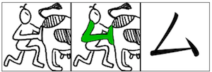

Color: cdce34

## /me/ - メ

I mended my pants. メ as in "mended".

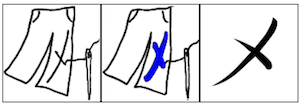

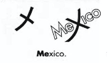

Color: cdce34

## /mo/ - モ

similar to も: the more worms, the more fish

There are four monitors. モ as in "monitors".

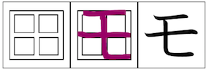

Color: cdce34

## /ya/ - ヤ

A yacht in the sea. ヤ as in "yacht".

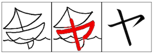

Color: fe9900

## /yu/ - ユ

I saw a U-boat. ユ as in "U-boat".

Color: fe9900

## /yo/ - ヨ

Ё, I can yoga!

I can yoga! ヨ as in "yoga".

Color: fe9900

## /ra/ - ラ

рама велосипеда

This is a Japanese lantern. ラ as in "lantern".

Color: fe0000

## /ri/ - リ

similar to り

This is her ribbon. リ as in "ribbon".

Color: fe0000

## /ru/ - ル

Roots of an apple tree. ル as in "roots".

Color: fe0000

## /re/ - レ 

Let's go! レ as in "let's".

Color: fe0000

## /ro/ - ロ

We have a loaf of bread. ロ as in "loaf".

Color: fe0000

## /wa/ - ワ

A wine glass. ワ as in "wine" glass.

Color: fe9900

## /wo/ (/o/) - ヲ

Wow! He's happy! ヲ as in "wow".

Color: fe9900

## /nn/ - ン

Mmm Yammy! ン as in "mmm". ("mmm" with your mouth open, or "nnn")

Color: fe9900
