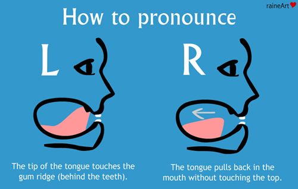

labels: Japanese
created: 2016-07-16T18:26

# Pronunciation

[TOC]

## Dropped vowels

### う in です

In "です" or "ます" the final "う" has completely dropped.

### い and う between unvoiced consonants

For example: すきです.

## Consonants pronunciation

### "r" pronunciation

More trilled.

Image source: [Why Can’t Japanese People Say L’s or R’s?](http://skeptikai.com/2012/09/10/why-cant-japanese-people-say-ls-or-rs/)

### "d" pronunciation

More strongly.

### Consonant clusters

There are no consonant clusters in Japanese. Consonants, except "n", must always be followed by a vowel.

## Sounds missing in Japanese

### "l" sound

Replace "l" -> "r".

### "v" sound

Replace "v" -> "b".

### "f" sound

Replace "f" -> "h".

## Links

[Japanese pronunciation on YouTube](https://www.youtube.com/watch?v=3K3kt_hkvAM)
