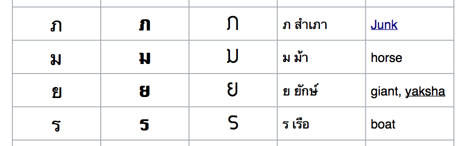

labels: Thai
created: 2016-09-13T17:22
modified: 2017-08-05T10:04

# Alphabet

[TOC]

http://www.omniglot.com/writing/thai.htm
https://www.youtube.com/watch?v=t_REY-8sVJs

## Consonants

Gor Gai group

ก - Gor Gai (middle tone)
ถ - Thor Thoong (rising tone)
ฌ - Chor Cher (low tone)
ญ - Yor Ying (low tone)
ณ - Nor Nen (low tone)
ภ - Phor Sam Phao (low tone)
ฎ - Dor Cha Daa (middle tone)
ฏ - Tor Pa Tag (middle tone)

Khor Khai group

ข - Khor Khai (rising tone)
[ฃ - Khor Khuad (rising tone)]
ช - Chor Chaang (low tone)
ซ - Sor So (low tone)
บ - Bor Bai Mai (middle tone)
ป - Por Plaa (middle tone)
ย - Yor Yag (low tone)
ษ - Sor Reu See (rising tone)

Kor Kwaai group

ค - Kor Kwaai (low tone)
[ฅ - Kor Kon (low tone)]
ฒ - Thor Phoo Thao (low tone)
ด - Dor Deg (middle tone)
ต - Tor Tao (middle)
ศ - Sor Saa Laa (rising tone)

Jor Jaan group

จ - Jor Jaan (middle tone)
ฉ - Chor Ching (rising tone)
ล - Lor Ling (low tone)
ส - Sor Sua (rising tone)
อ - Or Aang (middle tone)
ฮ - Hor Nog Hoog (low tone)

Phor Pheung group

ผ - Phor Pheung (rising tone)
ฝ - Fhor Fhaa (rising tone)
พ - Phor Phaan (low tone)
ฟ - For Fan (low tone)
ฬ - Lor Joo Laa (low tone)

Thor Thong group

ธ - Thor Thong (low tone)
ฐ - Thor Thaan (rising tone)
ร - Ror Rua (low tone)

Thor Mon Tho group

ฑ - Thor Mon Tho (low tone)
ท - Tor Ta Haan (low tone)
ห - Hor Heeb (rising tone)

Nor Noo group

น - Nor Noo (low tone)
ม - Mor Maa (low tone)

Ngor Ngoo group

ง - Ngor Ngoo (low tone)

Thor group

ฐ - Thor Thaan (rising tone)
ฑ - Thor Mon Tho (low tone)
ฒ - Thor Phoo Thao (low tone)
ถ - Thor Thoong (rising tone)
ธ - Thor Thong (low tone)

## Vowels (สระ)

`-ะ` (`-ั`) - a
`-า` - aa
`ิ` - i
`ี` - i:
`ึ` - eu (ы)
`ื` - eu: (ы:)
`ุ` - u
`ู` - u:
`เ-ะ` - e (э)
`เ-` - e: (э:)
`แ-ะ` - ae (aэ)
`แ-` - ae: (aэ:)
`โ-ะ` - o
`โ-` - o:
`เ-าะ` - oa
`-อ` - oa:
`ั-วะ` - ua
`ั-ว` - ua:
`เ-ียะ` - ia
`เ-ีย` - ia:
`เ-ือะ` - uea (uы)
`เ-ือ` - uea: (uы:)
`เ-อะ` - ia
`เ-อ` - ia:
`ไ-` - ai
`ใ-` - ayi (aї)
`เ-ำ` - ao
`-ำ` - am

`-วย` - uai/uay/oo-ey
`-อย` - oy
`ั-ย` - ai
`ั-น` - u/a
`-าย` - aai
`-าว` - ao/ow
`-ำ` - um/am
`ิว` - iew/iu
`เ-ย` - oei/oey/er-y
`เ-็ว` - eo/eow (short)
`เ-ว` - eo/eow (long)
`เ-็น` - e/eh
`เ-ิ` - er
`เ-ียว` - io, iaw
`เ-ือย` - eui
`เเ-ว` - aeo, aew
`โ-ย` - ouy
`ุย` - auy/ui
`-รร-` - un/unra

Sounds with a consonant:

ก์ - silent ga
ก้ - short ga
กิ - short gi
กุ - short gu
กึ - short gи
กา - long ga
กี - long gi
กู - long gu
กื - long gи
เกะ - shor ge
เเกะ - short gae
โกะ - short go
เก　- long ge
เเก - long gae
โก - long go
เกาะ - go
เกอะ - goe
เกีย - gia
ก้ว - gua
เกย - goe:y
กอ - long go
เกอ - long goe
เกือ - gua
เกา - gau
ไก - gai
กำ - gam
ใก - gai
กฤ - gru

## Tones

Tone numbers:

1. middle
2. low
3. falling
4. high
5. rising

## Fonts

See [Thai fonts pdf](thai_fonts.pdf).
